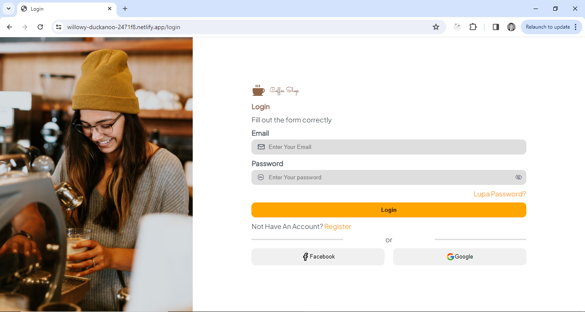
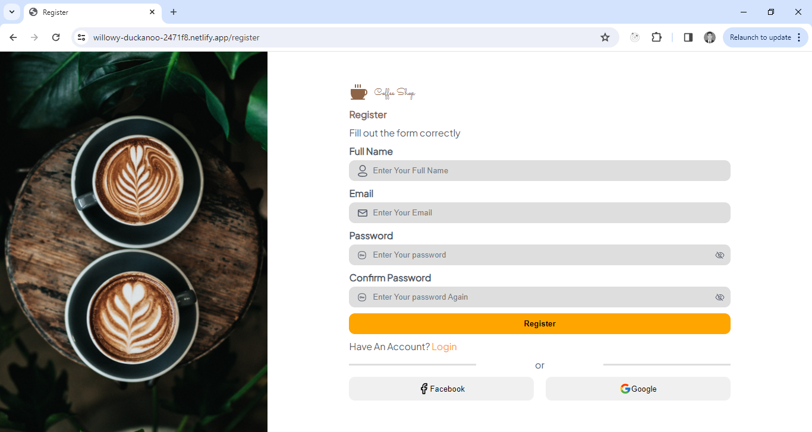
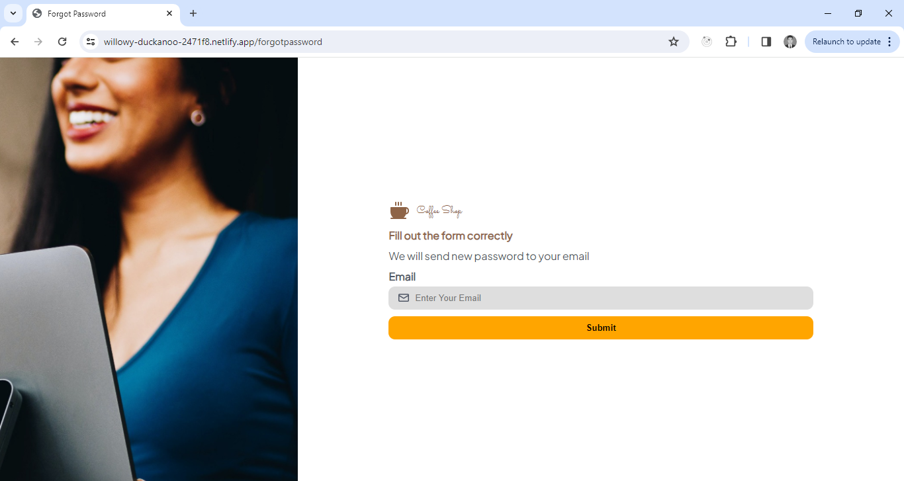
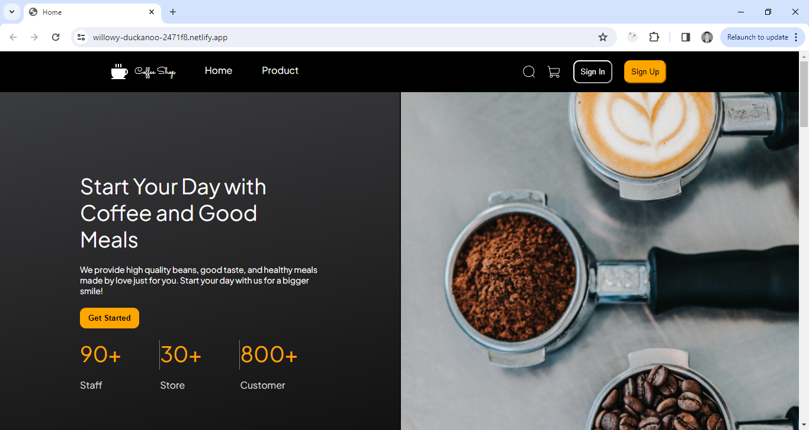
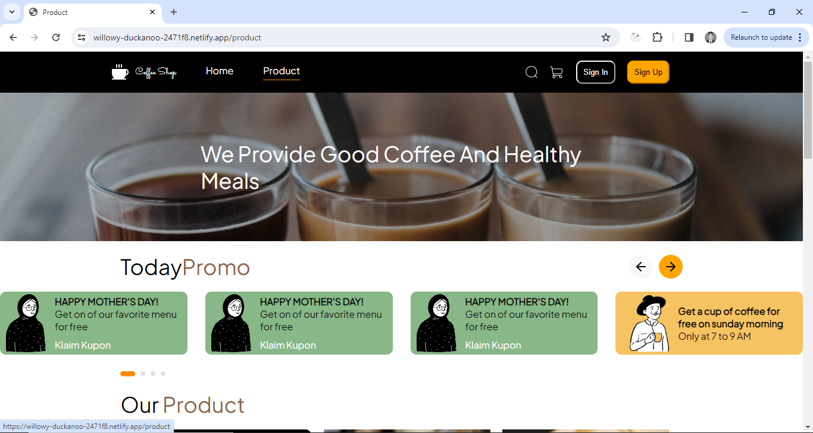
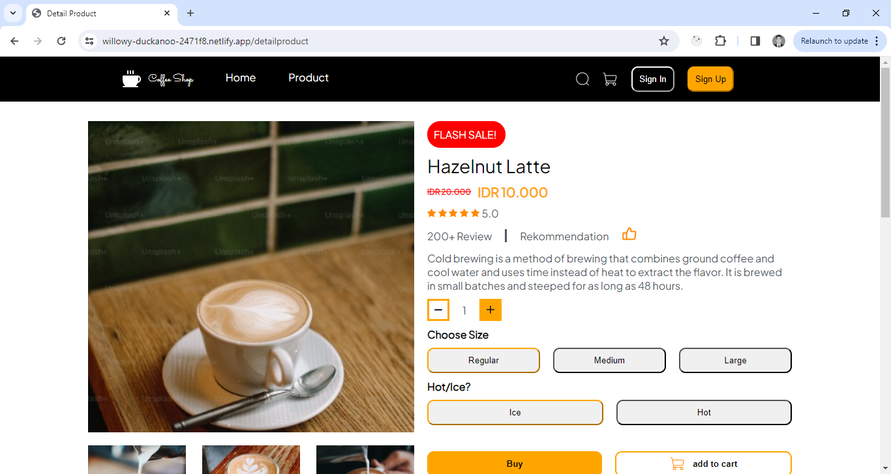
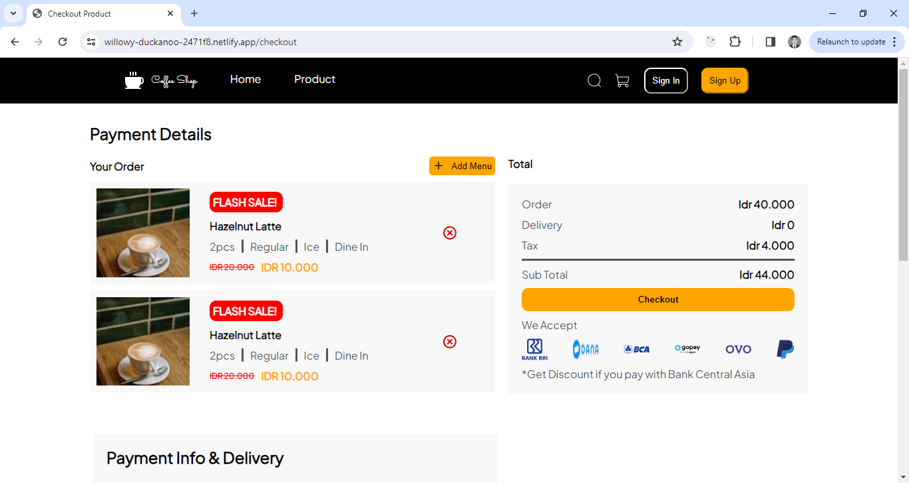
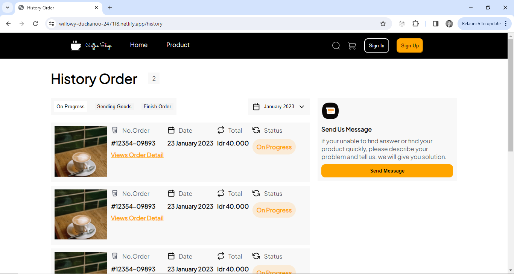
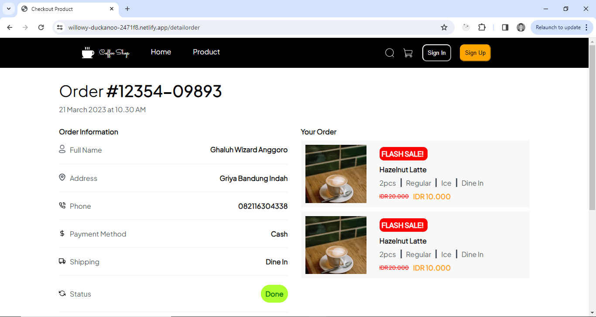
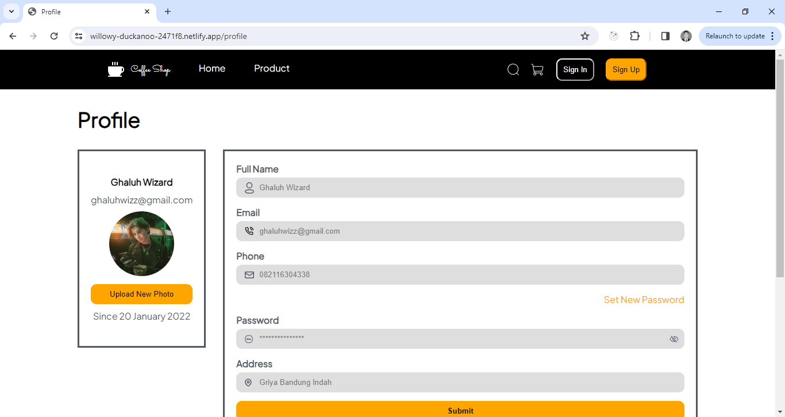

# Coffee Shop

A coffee shop project, built using HTML 5 Semantic website, CSS 3 Vanilla, and can be used by desktop and mobile.

## Built using

---

## Link Demo Website

### Login Page

https://willowy-duckanoo-2471f8.netlify.app/login

### Register Page

https://willowy-duckanoo-2471f8.netlify.app/register

### ForgotPassword Page

https://willowy-duckanoo-2471f8.netlify.app/forgotpassword

### Home Page

https://willowy-duckanoo-2471f8.netlify.app/home

### Product Page

https://willowy-duckanoo-2471f8.netlify.app/product

### Detail Product Page

https://willowy-duckanoo-2471f8.netlify.app/detailproduct

### Checkout Product Page

https://willowy-duckanoo-2471f8.netlify.app/checkout

### History Order Page

https://willowy-duckanoo-2471f8.netlify.app/history

### Detail Order Page

https://willowy-duckanoo-2471f8.netlify.app/detailorder

### Profile Page

https://willowy-duckanoo-2471f8.netlify.app/profile

## Contributing

Contributions are welcome! If you find any issues or want to add new features, feel free to open a pull request.

## Authors

- [@wisnu31899](https://github.com/wisnu31899)

## Feedback

If you have any feedback, please reach out to us at wisnuhidayat318@gmail.com
